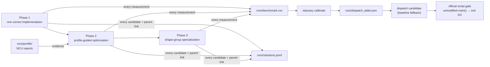

# The Odyssey of a Kernel

An agent-driven kernel optimization workflow for **TikTok TechJam 2026, Track 3
— Implement a GPU Kernel for a Transformer Layer**.

The submission is a transformer layer that runs faster than the organizer's
baseline while passing a zero-tolerance correctness check. The *project* is the
thing that produced it: a three-stage agent loop with a profiler in the decision
path, an evidence trail for every candidate it tried, and a dispatch layer that
refuses to serve a shape it has not proven itself on.

> Every AI company employs people whose job is making one matrix multiply 20%
> faster. It is the highest-paid, least scalable work in the industry.

That is the problem this repository is actually about. The kernel is the output.

## Status

Framework complete; the optimization campaign has not been run. Nothing here
reports a GPU speedup yet, and the tables that will hold those numbers say so.
What does work, end to end, on CPU today (one run; the timings move between
runs, the error columns do not):

```
fused-safe   plain           PASS   1.106x   max_abs=0
fused-safe   bf16            PASS   1.393x   max_abs=0
fused-sdpa   plain           PASS   1.353x   max_abs=7.15e-07
fused-sdpa   bf16            FAIL     --     max_abs=0.0312   (atol 0.001)
dispatch     bf16            PASS   1.376x   max_abs=0        -> routed to fused-safe
```

That `FAIL` is the harness working. `scaled_dot_product_attention` does not
reproduce the baseline's fp32 softmax on every backend; in bf16 the drift
accumulates across six residual layers and clears `atol`. Calibration saw it,
declined to admit `fused-sdpa` for bf16 geometries, and routed those shapes to
the variant whose error is zero by construction. Two candidates, one measurement,
no guessing.

## Method

Three stages, adapted from the workflow HAN Lab Kernel Mafia used to take 1st,
2nd and 3rd across the NVIDIA tracks of the
[MLSys 2026 FlashInfer contest](https://github.com/mit-han-lab/mlsys2026-flashinfer-contest).
Their Phase 3 — *analyze the workload distribution and specialize per shape
group* — is almost verbatim what this problem statement invites, since it
publishes the evaluation shapes in advance and permits branching on them.

| Stage | Goal | Prompt |
|---|---|---|
| Phase 1 | Research, then one implementation that is correct on every shape | [`prompts/transformer-layer/phase1.md`](prompts/transformer-layer/phase1.md) |
| Phase 2 | Profiling-guided optimization, five iterations per direction | [`prompts/transformer-layer/phase2.md`](prompts/transformer-layer/phase2.md) |
| Phase 3 | Shape-group specialization and a conservative dispatch table | [`prompts/transformer-layer/phase3.md`](prompts/transformer-layer/phase3.md) |



Their post-contest ablation found the plan/execute/verify harness dominated the
knowledge base and the profiler skill. This project takes that at face value:
install the harness, and spend the saved time on specialization and evidence
rather than on inventing search machinery.
[`odyssey.ablation`](odyssey/ablation.py) re-runs that experiment on a different
card and a different operator family, which is a result either way.

## Design

**The organizer's script is the scoreboard, and it is never edited.**
`bench/official/torch_transformer_benchmark.py` is vendored unmodified, with its
md5 recorded and checked. The harness imports its correctness rule, its data
generator and its timing primitives rather than reimplementing any of them, so a
sweep can return values instead of parsing stdout. When the printed transcript is
what you want, `odyssey official <candidate>` patches the candidate into
`UserOptimizedTransformer` at runtime and calls the script's own `main()` —
printing exactly what the organizers would see, returning their exit code.

**Every number is measured against the strongest available opponent.** The
script ships `--compile-baseline --compile-mode max-autotune`, so a much harder
baseline is one flag away for anyone in the room. `odyssey ladder` measures L0
eager, L1 `torch.compile`, L2 `max-autotune` and our candidates in one process,
rotating order between rounds so drift is shared rather than handed to whoever
ran first.

**Shipping is a policy, not a hope.** `odyssey calibrate` admits a candidate for
a geometry only if it passed correctness on *every* case in that group — padded
and dense alike, since a deployed model cannot tell them apart without a device
sync — and its **worst** speedup in the group clears a margin. Everything else
falls back to the baseline path. Without a table, `dispatch` *is* the baseline,
which is the right behaviour on day zero.

**The evidence is the deliverable.** `runs/benchmark.csv` takes one row per
measurement, `runs/solutions.jsonl` one node per candidate with a parent link —
rejected branches included — and `runs/profile/` the NCU reports. A dead end
recorded on the day it died is evidence; reconstructed on the last night it is a
guess.

## Contents

| Path | Purpose |
|---|---|
| `bench/official/` | The organizer's evaluator, vendored unmodified, plus a reading of its two contradictions |
| `bench/shapes/` | Shape sets as data: `smoke` (CPU correctness), `dev` (iteration set, aligned with the grid's center), `official` (the 14 appendix shapes) |
| `odyssey/` | The harness: script loader, shapes, registry, evaluate, ladder, calibrate, roofline, ablation, CLI |
| `kernels/` | Candidates: `passthrough` (control), `fused-safe`, `fused-sdpa`, `graph-safe`, `graph-sdpa`, `dispatch` |
| `prompts/` | The three phase prompts, plus the shared block they are built from |
| `docs/benchmark-anatomy.md` | Eight things the evaluator's source says, two of which contradict the obvious guess |
| `docs/precision-budget.md` | What the tolerance actually buys, and where we refuse to spend it |
| `docs/reproduction.md` | Environment, the card, and how to re-run the workflow |
| `docs/runpod.md` | Renting the card: pod spec, the ten-minute D0 gate, the NCU permission probe, evidence sync |
| `docs/deliverables.md` | What the project must be able to show, and which artifact shows it |
| `docs/pitch.md` | The three-minute script and the Q&A preparation |
| `scripts/` | `check_gpu.sh` (D0 gate, including whether NCU may profile), setup, ladder, sweep, smoke |

## Quick start

```bash
git clone https://github.com/justkyriecai/the-odyssey-of-a-kernel.git
cd the-odyssey-of-a-kernel
./scripts/setup_env.sh          # TORCH_INDEX=... for a specific CUDA wheel
./scripts/check_gpu.sh          # driver, torch, and whether ncu may profile
```

```bash
python -m odyssey list                      # candidates and shape sets
./scripts/smoke.sh                          # CPU correctness, seconds
./scripts/run_ladder.sh                     # the opponent, before writing anything
python -m odyssey bench all --shapes dev    # sweep, recorded to runs/
python -m odyssey calibrate --shapes dev    # build the dispatch table
python -m odyssey official dispatch --case center -- --atol 0.001 --rtol 0.01
```

## Agent workflow dependencies

The loop runs on Claude Code with one plugin and two skills:

```bash
# humanize: the plan/execute/verify harness
/plugin marketplace add PolyArch/humanize
/plugin install humanize@PolyArch
```

```bash
mkdir -p ~/.claude/skills && cd ~/.claude/skills
git clone https://github.com/mit-han-lab/KernelWiki.git
git clone https://github.com/mit-han-lab/ncu-report-skill.git
```

Run the search from a separate workspace, not from this repository:

```bash
mkdir -p workspaces && git clone . workspaces/round-1
cd workspaces/round-1
export TECHJAM_BENCHMARK="$OLDPWD/bench/official/torch_transformer_benchmark.py"
```

Every workspace then measures against the same file, and the md5 proves it.

## Two caveats stated up front

**Appendix shape #14 breaks the evaluator's own baseline.** At
`S=100000, d=1024, B=32`, the eager reference would need a ~10 GB causal mask
and ~12.8 TB of score tensors -- it cannot run on any hardware, and in fp32 its
q/k/v alone overflow a 24 GB card. Memory-efficient causal attention is a
requirement on that shape, not an optimization, and its reference output has to
be recomputed in chunks. `docs/benchmark-anatomy.md` §9 has the arithmetic.

**The runs are not deterministic.** Search order, profiling noise, GPU
scheduling and model behaviour all vary. Re-running the prompts will not
reproduce the same kernels or the same path. What is documented here is the
workflow, not an outcome.

## Prior work

- [mit-han-lab/mlsys2026-flashinfer-contest](https://github.com/mit-han-lab/mlsys2026-flashinfer-contest)
  — the three-stage workflow, the skill ablation, and the recording discipline
  this project adapts.
- [PolyArch/humanize](https://github.com/PolyArch/humanize) — the plan/execute/verify harness.
- [KernelWiki](https://github.com/mit-han-lab/KernelWiki) and
  [ncu-report-skill](https://github.com/mit-han-lab/ncu-report-skill) — kernel research and profile reading.
- [KernelBench](https://scalingintelligence.stanford.edu/blogs/kernelbench/) — the external yardstick for how hard LLM-written kernels are.
