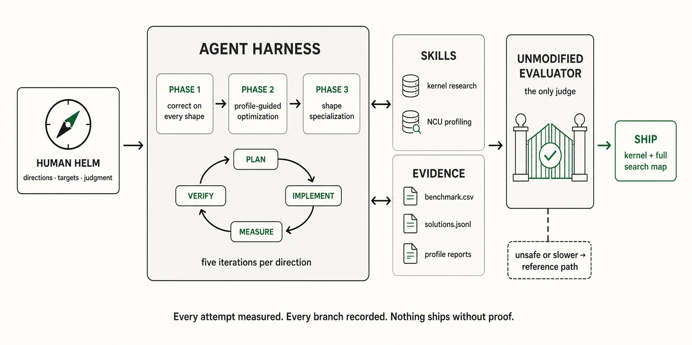
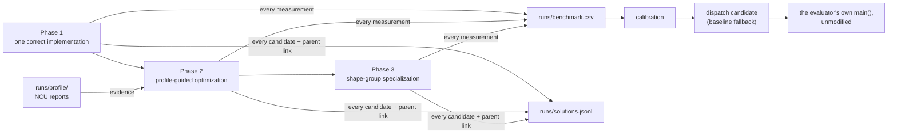

# The Odyssey of a Kernel

*An autonomous agent framework for GPU kernel optimization: the agent does the
exploring, tuning, measuring and record-keeping; you choose the directions; it
delivers the kernel plus the full map of every branch tried.*

An agent harness in the concrete sense: three phase prompts, four skills, one
plan/execute/verify loop, and the recording discipline that turns an agent's
search into evidence. Clone it, start a workspace for your operator, paste a
phase prompt into an agent session, and the agent does the rest -- including
writing down every branch it tried and why it died.

> Every AI company employs people whose job is making one matrix multiply 20%
> faster. It is the highest-paid, least scalable work in the industry.

That is the problem this repository is about. The kernel is the output; the
method is the project. The first workspace is **TikTok TechJam 2026 Track 3** --
a transformer layer, faster than the organizer's baseline under a
zero-bad-element correctness check -- and it is the worked example for every
workspace after it: [`workspace/transformer-forward-opt/`](workspace/transformer-forward-opt/).

## What the first voyage brought home

One day, one rented RTX 6000 Ada, the organizer's unmodified script as the only
judge:

- **Never slower than the eager baseline, anywhere.** 13/13 official shapes at
  the zero-bad-element tolerance -- worst case 1.23x, best 12.3x, and **16.1x**
  where attention dominates.
- **Ahead of the strongest numerically admissible `torch.compile`
  configuration** on every measured lane -- after the agent proved that
  `max-autotune` itself fails the benchmark's own tolerance.
- **The shape no reference can run** -- at S=100,000 the baseline needs ~12.8 TB
  of score tensors -- served in 23.2 s, zero bad elements out of 3.28 billion,
  judged by the script's own comparator (labeled off-script, never claimed as
  an official pass).
- **Bit-exact where no compiled path is numerically legal**: bf16/fp16 lanes
  ship at max_abs = 0 and ~2.5x over eager.
- **77% of the card's measured TF32 roof** on the GEMM-bound shape -- a roofline
  drawn from ceilings timed on the card, never spec sheets.

Behind the numbers: ~400 recorded measurements and a 19-node search DAG, every
wrong turn included. Provenance for each figure:
[`workspace/transformer-forward-opt/README.md`](workspace/transformer-forward-opt/README.md)
and [`docs/campaign-log.md`](workspace/transformer-forward-opt/docs/campaign-log.md).

## What is in the box

| Path | Purpose |
|---|---|
| [`prompts/template/`](prompts/) | The three phase prompts with every task-specific slot marked `<<...>>`, and the shared block they are built from |
| [`skills/`](skills/) | The four `odyssey-` skills: `onboarding`, `create-workspace`, `kernelwiki` (kernel research) and `ncu-report` (reading Nsight Compute). Vendored, not submodules -- see each one's `VENDORED.md` |
| [`scripts/`](scripts/) | `setup_env.sh`, `setup_agent.sh` (humanize, and links `skills/` into `.claude/skills/`), `check_gpu.sh` (the D0 gate), `new_workspace.sh`, `build_prompts.py` |
| [`docs/method.md`](docs/method.md) | The three phases, the loop inside each, and the disciplines that bound a search |
| [`docs/new-task.md`](docs/new-task.md) | Starting a workspace for another operator |
| `workspace/<task>/` | Everything about one task: the evaluator (vendored, never edited), shape sets, candidates, prompts, docs, the machine it runs on, and the evidence under `runs/` |
| [`CLAUDE.md`](CLAUDE.md) | The rules an agent works under, everywhere in this repository |

There is no framework code. The framework is what the agent reads -- prompts,
rules, skills -- and what it is made to write: `benchmark.csv`,
`solutions.jsonl`, profiler reports. A workspace carries one thin `verify.py`
that runs its evaluator unmodified with a candidate patched in: the evaluator's
own `main()`, its own output, its own exit code.

## Method



Three stages, adapted from the workflow HAN Lab Kernel Mafia used to take 1st,
2nd and 3rd across the NVIDIA tracks of the
[MLSys 2026 FlashInfer contest](https://github.com/mit-han-lab/mlsys2026-flashinfer-contest).

| Stage | Goal | Prompt |
|---|---|---|
| Phase 1 | Research, then one implementation that is correct on every shape | `prompts/phase1.md` |
| Phase 2 | Profiling-guided optimization, five iterations per direction, a target set by the human | `prompts/phase2.md` |
| Phase 3 | Shape-group specialization behind a conservative dispatch policy | `prompts/phase3.md` |

Each phase is one prompt, pasted into a fresh session started in the workspace
directory. Inside a phase, one loop runs end to end:

1. **Plan** the attempt -- draft in `docs/draft.md`, then `/humanize:gen-plan`
   and `/humanize:start-rlcr-loop`;
2. **Implement** the candidate;
3. **Measure** it through the unmodified evaluator -- the only judge;
4. **Profile** -- the next move comes from the timeline, not intuition;
5. **Record** -- every measurement into `runs/benchmark.csv`; every candidate,
   rejected branches included, onto `runs/solutions.jsonl`;
6. **Review** -- adversarial, fresh-context, at round boundaries.

Five iterations per direction, then move on. The agent takes the toil; the
human keeps the helm: directions, targets, judgment.



Their post-contest ablation found the plan/execute/verify harness dominated
both the knowledge base and the profiler skill (1.37x → 3.71x with humanize,
6.14x with the kernel wiki, 8.58x with the profiler skill). This project takes
that at face value: install the harness, and spend the time on specialization and
evidence rather than on inventing search machinery.

## Four rules every workspace inherits

**The evaluator is the scoreboard, and it is never edited.** It is vendored
unmodified with its md5 recorded. Nothing re-implements its correctness rule or
its timer; `verify.py` runs its `main()` with the candidate patched in and reads
the verdict off what it printed.

**Every number is measured against the strongest available opponent.** If the
evaluator can compile its own baseline, that is the denominator to quote. A net
gain over `torch.compile max-autotune` is a number nobody can take away.

**Shipping is a policy, not a hope.** A specialization serves a geometry only
if it passed correctness on every case in that group and its *worst* speedup
clears a margin; everything else falls back to the reference path. "Never
slower than what it replaces" is a property, not an aspiration.

**The evidence is the deliverable.** One row per measurement, one node per
candidate with a parent link -- rejected branches included -- and a profile per
direction. A dead end recorded on the day it died is evidence; reconstructed on
the last night it is a guess.

## Quick start

```bash
git clone https://github.com/justkyriecai/the-odyssey-of-a-kernel.git
cd the-odyssey-of-a-kernel
./scripts/setup_env.sh          # TORCH_INDEX=... for a specific CUDA wheel
./scripts/setup_agent.sh        # humanize plugin; links skills/ into .claude/skills/
./scripts/check_gpu.sh          # on a GPU box: driver, torch, and which profiler works
```

Or, in a session started at the repository root, ask for the
`odyssey-onboarding` skill: it runs the same setup, checks every skill loads
under the name it declares, and refreshes the routing block in `CLAUDE.md`.

```bash
cd workspace/transformer-forward-opt
./scripts/smoke.sh                                  # CPU correctness, seconds
python verify.py --list                             # candidates, shape sets, the evaluator's md5
python verify.py fused-safe --shapes dev --record   # a sweep, recorded to runs/
./scripts/run_ladder.sh                             # the opponent, before writing anything
```

Then, in tmux, start a fresh Claude Code session in the workspace directory and
paste `prompts/phase1.md`. Then phase 2, then phase 3, raising the target between
rounds.

## Starting a workspace for another operator

```bash
./scripts/new_workspace.sh my-op-h100-20260830
```

or ask an agent for the `odyssey-create-workspace` skill, which takes a task
description and a card, names the directory `<task>-<gpu>-<date>`, and fills in
the workspace `CLAUDE.md` and the slots in `prompts/_shared.md` with whatever
the description already answered.

Moving the same task to another card is a new workspace, not an edit of the old
one:

```bash
./scripts/new_workspace.sh my-op-b200-20260912 --from my-op-h100-20260830
```

carries the evaluator, the shapes, `verify.py` and the candidates across, and
leaves `runs/` empty -- a number measured on one card is not evidence about
another. The old workspace stays as the record of what happened on it.

Either way you get the skeleton, the phase prompts from the template, a
`verify.py` to adapt, and a README listing what is still yours to do. [`docs/new-task.md`](docs/new-task.md) walks through it. The second
operator is what turns "we built an agent for this problem" into "we built an
agent".

## Two caveats stated up front

**The runs are not deterministic.** Search order, profiling noise, GPU
scheduling and model behaviour all vary. Re-running the prompts will not
reproduce the same kernels or the same path. What is documented here is the
workflow, not an outcome.

**Prompts are hardware-specific by construction.** The hardware section of a
workspace's `_shared.md` is the first thing to rewrite when the card changes
and the most expensive to get wrong.

## Prior work

- [mit-han-lab/mlsys2026-flashinfer-contest](https://github.com/mit-han-lab/mlsys2026-flashinfer-contest)
  -- the three-stage workflow, the skill ablation, and the recording discipline
  this repository adapts.
- [PolyArch/humanize](https://github.com/PolyArch/humanize) -- the plan/execute/verify harness.
- [KernelWiki](https://github.com/mit-han-lab/KernelWiki) and
  [ncu-report-skill](https://github.com/mit-han-lab/ncu-report-skill) -- kernel research and profile reading.
- [KernelBench](https://scalingintelligence.stanford.edu/blogs/kernelbench/) -- the external yardstick for how hard LLM-written kernels are.

## License

[MIT](LICENSE). The vendored skills under `skills/odyssey-kernelwiki/` and
`skills/odyssey-ncu-report/` carry their upstream MIT licenses; each one's
`VENDORED.md` records where it came from.
