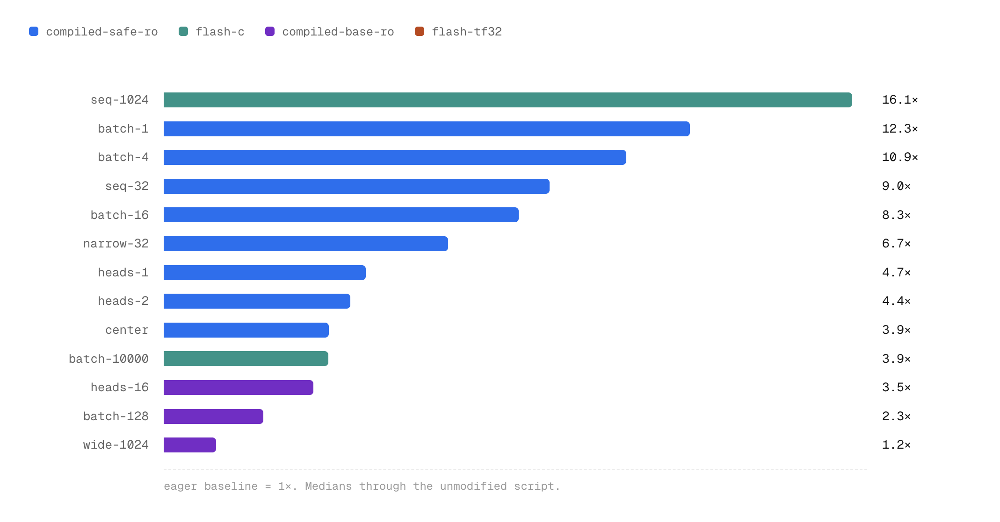
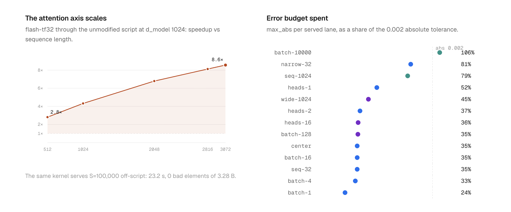
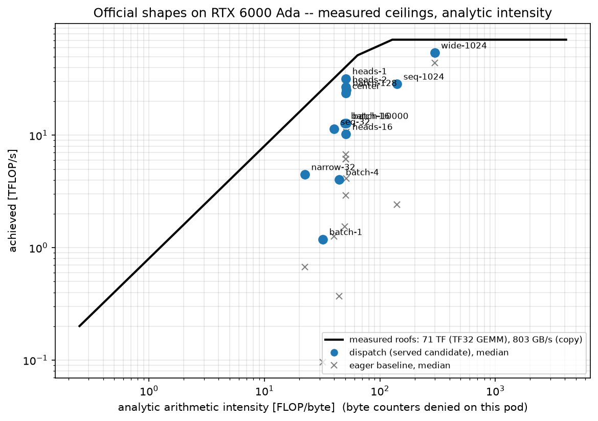

# A Transformer Layer, Faster Than Its Own Compiler

**Tech report — TikTok TechJam 2026, Track 3: Implement a GPU Kernel for a
Transformer Layer.**

One day, one rented GPU, and the organizer's unmodified benchmark script as
the only judge. The submission is a transformer forward pass that routes each
input shape to the fastest implementation proven correct for it. It passes
all 13 runnable official shapes at the official tolerance, between 1.23x and
16.1x faster than the baseline, and is never slower than the baseline
anywhere. It also stays ahead of the fastest `torch.compile` configuration
that passes the benchmark's own correctness check — because the first thing
the campaign established is that the obvious opponent, `max-autotune`, does
not pass it.

Every number below comes from the organizer's script, byte-for-byte
unmodified (md5 `21584e5923680ce0455554bd0b45bda2`), run through
[`verify.py`](../verify.py), which patches the candidate in and calls the
script's own `main()`. All 387 measurements are in
[`runs/benchmark.csv`](../runs/benchmark.csv); each row carries the git
commit, the script checksum, the driver version and the exact flags of the
run that produced it.

## 1. Environment

| | |
|---|---|
| **GPU** | NVIDIA RTX 6000 Ada Generation — AD102, sm_89, 142 SMs, 48 GB |
| **CPU** | 192 cores on the host |
| **Disk** | 50 GB persistent network volume (checkout, tools, evidence) + 20 GB local container disk (OS and the venv) |
| **Software** | Ubuntu 22.04 · Python 3.12 · PyTorch 2.8.0+cu128 · CUDA 12.8 · driver 580.126.20 |
| **Where** | RunPod Secure Cloud, rented by the hour |

Two environment facts cost real time before any kernel work started, so they
are worth recording. The venv lives on the local disk, not the network
volume: that alone cut `import torch` from 5.0 s to 1.4 s. And 192 CPU cores
are a hazard for tiny tensors — the CPU correctness gate ran a 0.47 ms case
in 1794 ms under 192 default OpenMP threads, so the gates pin a single
thread. The full day-zero check dropped from over ten minutes to 7.6 s.

**Profiling on this pod.** Hardware performance counters are denied
(`ERR_NVGPUCTRPERM`: the host driver sets `RmProfilingAdminOnly=1`, and no
fix exists from inside a container), so Nsight Compute is unavailable.
Nsight Systems and `torch.profiler` work. Every profiling claim in this
report is therefore timeline evidence — kernel counts, launch gaps,
per-kernel times — and is labeled as such.

**Measured ceilings.** Rooflines and "percent of peak" claims below use
ceilings timed on this card ([`runs/ceilings.json`](../runs/ceilings.json)),
never spec sheets:

| Ceiling | Measured |
|---|---:|
| TF32 GEMM (n=8192) | 70.7 TFLOPS |
| IEEE fp32 GEMM (n=8192) | 30.3 TFLOPS |
| Device-to-device copy | 803 GB/s (spec: 960) |

## 2. The benchmark and its rules

The script builds a Pre-LN transformer (bias on every linear, exact-erf
GELU, attention softmax computed in fp32 and cast back), copies its weights
into the candidate with `load_state_dict(strict=True)`, and checks the
candidate's output element by element. The rule: an element passes if
`abs_err <= 0.002` **or** `abs_err <= 0.02 * |ref|`, and **zero failing
elements are tolerated** — one element over budget fails the run, and any
NaN or Inf fails it outright. That single sentence rules out FP8 (3 mantissa
bits, ~6% relative error) and the tanh GELU approximation before any
speedup argument starts.

Three more facts that shaped the work:

- **The baseline is not naive.** TF32 tensor cores are on by default, so
  "we used tensor cores" is already taken. And the script can compile its
  own baseline — `--compile-baseline --compile-mode max-autotune` — so the
  real opponent is one flag away for anyone in the room.
- **Padding is applied in four places.** The reference zeroes the input,
  masks attention keys, and zeroes the output twice more downstream. Two of
  those have no analogue inside fused attention kernels: a naive SDPA swap
  passes at the default padding ratio of 0 and fails the moment padding is
  turned on. Every candidate here is measured on dense *and* padded cases.
- **The timing protocol is already careful** — CUDA events, 20 warmup
  iterations, 3×100 timed repeats with the measurement order alternated
  between rounds, speedup taken as a ratio of medians. We report its
  medians with p90 alongside and never a best-of run.

The official grid (Appendix 3.7) is 14 causal shapes: a one-factor sweep
around a center of `B=64, S=128, d_model=128, heads=4, ffn=128, layers=4` —
batch up to 10000, sequence 32 to 1024, width 32 to 1024, heads 1 to 16 —
plus shape #14 at `B=32, S=100000, d_model=1024`. That last one deserves its
own paragraph: the reference implementation materializes attention scores,
which at S=100000 is a 12.8 TB tensor. **The script's own baseline cannot
run shape #14 on any hardware that exists.** Section 6 covers what we did
about that.

## 3. Where the time goes

An Nsight Systems trace of the eager baseline at the center shape shows
~116 kernel launches per forward with a median kernel time of 4–11 µs
([`runs/profile/00-regime-anatomy/`](../runs/profile/00-regime-anatomy/)) —
the GPU spends the shape waiting for launches, not computing. The grid
sweeps one factor at a time, so it is really four problems wearing one
config format:

| Regime | Shapes | Bottleneck |
|---|---|---|
| Launch-bound | center, batch-1…128, seq-32, narrow-32, heads-1…16 | kernel count |
| Attention-bound | seq-1024, batch-10000 | materialized S×S score tensors |
| GEMM-bound | wide-1024 | cuBLAS already near the measured roof |
| Memory-impossible | shape #14 (S=100000) | reference needs 12.8 TB |

Each regime got its own attack, and one dispatch layer stitches them
together.

## 4. The opponent, measured honestly

`torch.compile` rewrites the baseline's ~116 kernels into ~5 fused Triton
kernels. At the center shape, `max-autotune` runs 0.33 ms against eager's
1.40 ms — a 4.3x opponent for free. Beating eager and losing to a flag would
not be a result, so the campaign measured the compiler first. Two findings
set up everything that follows.

**Finding 1: `max-autotune` fails the benchmark's own tolerance.** Compiled
against its own eager weights, the baseline drifts `max_abs = 0.0053` in
fp32 and `0.0625` in bf16 — past the official tolerance, with zero failing
elements allowed. The causes are isolated and reproducible: TF32 rounding
differs between cuBLAS and Triton's GEMM templates (disabling TF32 collapses
the fp32 drift to 1.4e-6), and Inductor's fused softmax skips the
reference's round-to-bf16-before-softmax step. So the honest opponent is the
**fastest numerically admissible configuration**: `reduce-overhead`, which
passes on every fp32 lane. In bf16 and fp16, *no* compiled mode passes at
all — there the admissible opponent is eager itself.

**Finding 2: the measurement itself has a trap.** Our first opponent sweep
ran all cases in one process and tripped Dynamo's recompile limit (8 per
code object), after which "compiled" baselines silently ran eager — we were
recording eager numbers under a compiled label. The corrected protocol runs
one case per process. Every opponent number below comes from that protocol.

The opponent, per lane (compiled baseline under `reduce-overhead`, fresh
process each, official tolerance): center 0.368 ms · batch-1 0.133 ms ·
batch-128 0.683 ms · heads-16 0.777 ms · seq-1024 24.77 ms · wide-1024
7.64 ms.

## 5. What we ship

The shipped candidate is a **dispatch layer** — shape checks in `forward`,
a mechanism the problem statement explicitly endorses — backed by a
calibrated table ([`runs/dispatch_table.json`](../runs/dispatch_table.json)).
A candidate serves a geometry only if it passed correctness on **every**
recorded case of that geometry, dense and padded, and its **worst-case**
speedup beats 1.05x. Everything else falls back to the baseline path.
"Never slower than the baseline" is therefore a property of the table, not
a hope — and the table construction is one command
(`python kernels/dispatch.py calibrate`) reading `runs/benchmark.csv`.

Five implementations sit behind it:

**`compiled-safe-ro`** — the restructured body. One QKV GEMM per layer
instead of three, attention masks built *inside* the compiled graph in
decomposed broadcast form (never materializing a `[B,1,S,S]` tensor), and
the reference's exact fp32-softmax semantics preserved. Compiled with
`torch.compile(mode="reduce-overhead")` **inside the candidate**, so GEMMs
stay on cuBLAS numerics and CUDA-graph replay comes from cudagraph trees.
Moving mask construction in-graph is what flipped the launch-bound lanes:
every op left outside the graph is a launch paid on every call. Serves the
launch-bound group — batch-1 at 0.113 ms is 12.3x over eager and 18% ahead
of the opponent.

**`flash-tf32`** — a Triton online-softmax attention kernel: fp32 softmax
recurrence, TF32 tensor-core dots, padding handled as per-row valid lengths,
O(S·d) memory so the S×S score tensor never exists. A tile probe at
head_dim 64 found 128×64 tiles with 8 warps run 63% faster than the
default tile. Owns the long-sequence axis, and is the only implementation
that can touch shape #14.

**`flash-c`** — the flash kernel traced into a `reduce-overhead` compiled
body. Dynamo captures user Triton kernels natively, so Inductor fuses the
LayerNorm/FFN/residual glue around our attention kernel — the ~116-launch
overhead the eager wrapper was still paying. This hybrid takes seq-1024 to
4.84 ms (16.1x eager, 5.1x the opponent) and batch-10000 to 84.6 ms: at
batch-10000 the glue, not attention, was the entire remaining gap.

**`compiled-base-ro`** — the opponent's own program, shipped as a
candidate. On three geometries (batch-128, heads-16, wide-1024) no
restructured body beat the admissible compiled baseline, so dispatch serves
exactly that program there. "Never behind the opponent" holds on those
lanes by construction.

**`graph-safe`** — manual CUDA-graph capture over an eager-exact fused
body. This is the bf16/fp16 path: since no compiled configuration is
numerically admissible in reduced precision, the win there must come from
launch elimination alone, with **bit-identical output** (`max_abs = 0` on
every served lane).

One sibling earns a mention: **`flash-fp32`**, the IEEE variant of the
flash kernel, is the correctness spine — and the measured explanation of
the TF32 trade, since IEEE fp32 GEMM runs at 30 TFLOPS on this card against
TF32's 71.

## 6. Results



*Median speedup over the eager baseline, official tolerance, through the
unmodified script. Colors are the dispatch table's choices: blue
`compiled-safe-ro`, teal `flash-c`, purple `compiled-base-ro`.*

### The official grid

Dispatch validation over all 13 runnable official shapes, fp32, eager
baseline as denominator. Center geometry is `B=64, S=128, d=128, H=4`;
each row changes one factor.

| Shape | Change | Served by | Eager ms | Ours ms | p90 | Speedup | max_abs |
|---|---|---|---:|---:|---:|---:|---:|
| seq-1024 | S=1024 | flash-c | 78.14 | 4.84 | 5.08 | **16.1x** | 1.6e-3 |
| batch-1 | B=1 | compiled-safe-ro | 1.39 | 0.113 | 0.120 | 12.3x | 4.9e-4 |
| batch-4 | B=4 | compiled-safe-ro | 1.44 | 0.133 | 0.133 | 10.9x | 6.6e-4 |
| seq-32 | S=32 | compiled-safe-ro | 1.39 | 0.154 | 0.154 | 9.0x | 7.0e-4 |
| batch-16 | B=16 | compiled-safe-ro | 1.40 | 0.168 | 0.168 | 8.3x | 7.0e-4 |
| narrow-32 | d=32 | compiled-safe-ro | 1.40 | 0.209 | 0.224 | 6.7x | 1.6e-3 |
| heads-1 | H=1 | compiled-safe-ro | 1.27 | 0.269 | 0.279 | 4.7x | 1.0e-3 |
| heads-2 | H=2 | compiled-safe-ro | 1.40 | 0.319 | 0.331 | 4.4x | 7.4e-4 |
| center | — | compiled-safe-ro | 1.41 | 0.363 | 0.372 | 3.9x | 7.0e-4 |
| batch-10000 | B=10000 | flash-c | 326.72 | 84.64 | 84.77 | 3.9x | 2.1e-3 |
| heads-16 | H=16 | compiled-base-ro | 2.94 | 0.838 | 0.870 | 3.5x | 7.1e-4 |
| batch-128 | B=128 | compiled-base-ro | 1.60 | 0.684 | 0.686 | 2.3x | 7.1e-4 |
| wide-1024 | d=1024 | compiled-base-ro | 9.77 | 7.93 | 8.26 | 1.23x | 8.9e-4 |

13/13 PASS at zero bad elements; worst case 1.23x. Padded spot-checks pass
on the same table: center 4.0x, seq-1024 12.7x, batch-128 2.3x.
batch-10000's `max_abs` of 2.1e-3 sits above the absolute tolerance and
passes on the rule's relative branch — the offending element's reference
magnitude is above 0.1, where 2% relative applies.

### Against the compiler

| Lane | Admissible opponent | Ours | Margin |
|---|---:|---:|---|
| center | 0.368 ms | 0.363 ms | parity, inside process-to-process spread |
| batch-1 | 0.133 ms | 0.113 ms | +18% |
| seq-1024 | 24.77 ms | 4.84 ms | **5.1x** |

On batch-128, heads-16 and wide-1024, dispatch ships the opponent's own
compiled program, so it cannot trail there. In bf16/fp16 no compiled
configuration is admissible, and our bit-exact graph path leads eager — the
only legal denominator — on every served lane. The one number nobody can
argue with: **there is no measured lane on which this submission is behind
the strongest numerically admissible `torch.compile` configuration.**

### Reduced precision: exactly zero error

The reference rounds attention scores to bf16 *before* its fp32 softmax;
every Inductor fusion skips that rounding and fails by 0.0625. So the
bf16/fp16 lanes ship `graph-safe`, which replays the reference arithmetic
kernel-for-kernel:

| Lane | bf16 | fp16 |
|---|---:|---:|
| center | 2.62x | 2.42x |
| seq-1024 | 1.18x | 1.18x |
| batch-128 | 1.19x | 1.16x |
| heads-16 | 1.08x | fallback |

Every served cell measures `max_abs = 0` — bit-identical output.
heads-16-fp16 measured 1.027x, under the 1.05 admission margin, so that
lane honestly falls back to the baseline path rather than shipping a win
the rule cannot vouch for.

### The shape the baseline cannot run



*Left: flash-tf32 through the unmodified script at the stress geometry
(d_model=1024), S=512 → 3072. Right: worst-element error per served lane as
a share of the 0.002 absolute tolerance.*

The unmodified script verifies `flash-tf32` at the stress geometry from
S=512 (2.8x) to S=3072 (8.6x, 84.4 ms vs eager's 722.7 ms) — beyond that,
the reference's score tensor no longer fits any card. At **S=100,000**,
where the reference would need ~12.8 TB, the same kernel serves the shape
in **23.2 s** (first recorded run peaked at 36.8 GiB of VRAM). Correctness
is established off-script, and labeled that way everywhere: a chunked
orchestrator recomputes the reference arithmetic piecewise — proven
byte-exact against the script's own model at S=2048 — and the script's own
comparator judges the result at the official tolerance: **zero bad elements
out of 3,276,800,000**. We report it as an off-script agreement, never as
an official pass.

### The roofline says the remaining headroom is small



*Measured roofs (71 TF TF32 GEMM, 803 GB/s copy), analytic intensity —
byte counters are denied on this pod and the plot says so. Dots are served
lanes; crosses are eager.*

wide-1024's served point reaches **77% of the measured TF32 GEMM roof**,
which is why its 1.23x is close to the attainable limit rather than a
shortfall. The launch-bound lanes sit far from the roof for a reason the
timeline already named: their remaining distance is launch overhead, not
bandwidth, and it is exactly what the compiled and graph-captured paths
keep shrinking.

### Error budget

Served fp32 lanes spend between 24% and 81% of the absolute error budget at
their worst element (right panel above); batch-10000's 106% is the
relative-branch case described earlier. Reduced-precision lanes spend 0%.
Sweeping `input_scale` (0.25, 1.0, 4.0) on the served winners: all PASS,
with scale 0.25 pushing center's spend to 80% — measured confirmation that
error budgets do not transfer across input scales, recorded in
[`precision-budget.md`](precision-budget.md).

## 7. How it was built

The campaign ran inside this repository's agent harness: an AI agent did
the implementing, measuring, profiling and record-keeping; the human set
directions and targets. Four rounds of a plan → implement → measure →
profile → record → review loop, with adversarial fresh-context review at
round boundaries. The full session-by-session record is
[`campaign-log.md`](campaign-log.md).

The reviews changed the outcome, and the catches are on the record: the
recompile-limit measurement corruption (Finding 2 above), a dispatch
fallback that recursed through its own `forward` (now guarded by a
regression test), a headline number quoted from the best process instead of
the reproducible one (0.337 ms restated as 0.362), and an unpinned SDPA
backend. The evidence discipline is the deliverable: 387 recorded
measurements, a 19-node candidate DAG with every rejected branch and the
evidence that killed it ([`runs/solutions.jsonl`](../runs/solutions.jsonl)),
and a profile for every direction.

A two-arm ablation ([`runs/ablation/REPORT.md`](../runs/ablation/REPORT.md))
isolates what the harness buys, contaminations disclosed. A bare agent with
only the evaluator matched the launch-bound numbers in 13 minutes — then
shipped its padding fallback unverified, never tested reduced precision,
and produced nothing on shape #14. The harness arms closed exactly those
gaps, and one of them independently rediscovered Finding 1 in 12 minutes.
The honest claim: the harness converts effort into ceiling, coverage, and
findings that reproduce — seq-1024 at 16.1x is twice the bare arm's best.

## 8. Limitations

- **No hardware counters on this pod.** Stall reasons, DRAM bytes and
  occupancy are absent; the roofline's intensity axis is analytic and
  labeled. A box that grants counters upgrades the evidence, not the
  numbers.
- **The dispatch table is calibrated per card.** On other hardware it
  degrades safely to the baseline path until
  `python kernels/dispatch.py calibrate` re-derives it from fresh
  measurements.
- **heads-16-fp16 ships no win** — 1.027x is real but below the admission
  margin, and the rule is the rule.
- **Shape #14 has no official verdict by construction** — the script's own
  reference cannot run it; our off-script evidence chain is the strongest
  statement physics allows.
- **Agent runs are not deterministic.** Re-running the prompts reproduces
  the workflow and the discipline, not the same kernels.

## 9. Reproduce

From this directory, with the repository venv
(`../../scripts/setup_env.sh`):

```bash
./scripts/smoke.sh                       # CPU correctness gate, seconds
python verify.py --list                  # candidates + the script's md5
./scripts/run_ladder.sh                  # eager, then the compiled opponent
python verify.py dispatch --shapes official --record -- --atol 0.002 --rtol 0.02
python scripts/stress_100k.py --self-check && python scripts/stress_100k.py flash-tf32
python scripts/measure_ceilings.py && python scripts/plot_roofline.py
./scripts/demo.sh <case>                 # any official shape: script, verdict, exit code
```

The evidence this report cites: [`runs/benchmark.csv`](../runs/benchmark.csv)
(every measurement), [`runs/solutions.jsonl`](../runs/solutions.jsonl) (the
search DAG), [`runs/dispatch_table.json`](../runs/dispatch_table.json) (what
serves what, and why), [`runs/profile/`](../runs/profile/) (timelines),
[`runs/ceilings.json`](../runs/ceilings.json) (the measured roofs), and
[`campaign-log.md`](campaign-log.md) (the narrative with provenance for
every claim above).
